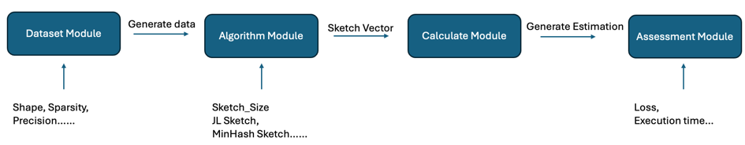
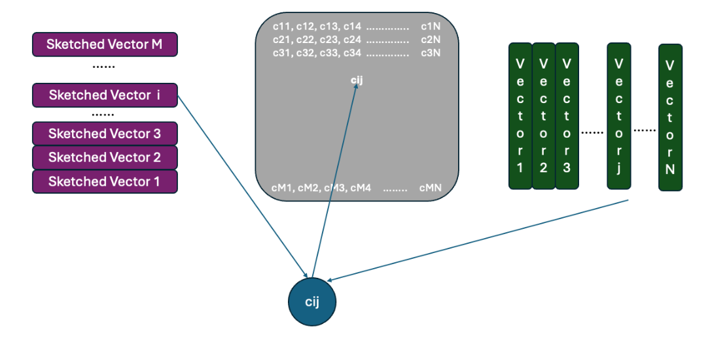
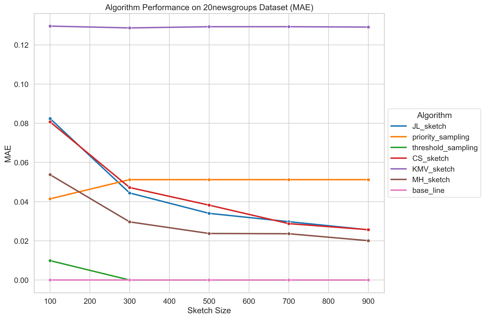
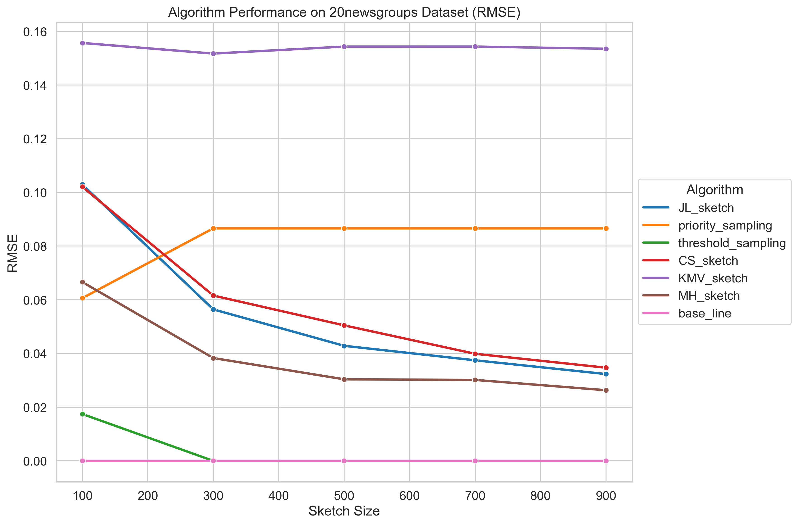
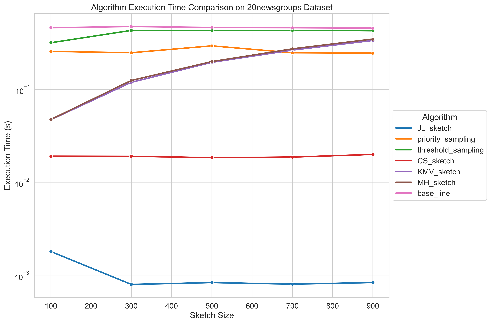
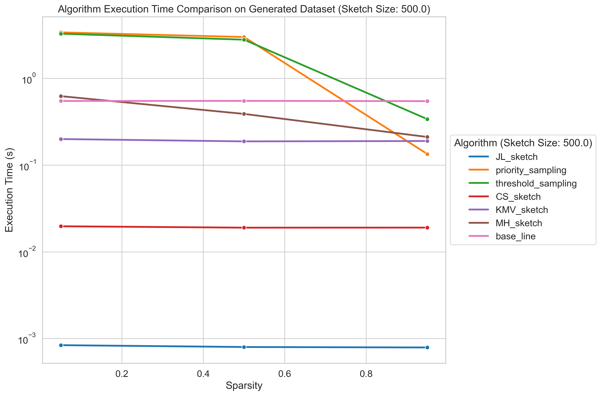
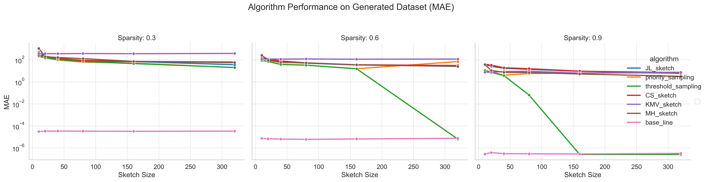
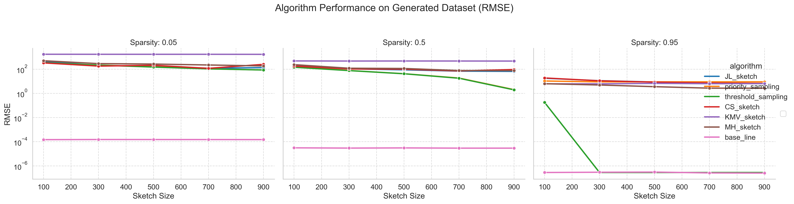

# BigData_CSGY6513_24Sp
## Introduction
This project centers on benchmarking vector inner product estimation methods, aiming to enhance computational efficiency in scientific and engineering applications. We provide a systematic evaluation of various sketching techniques under differing data conditions, focusing primarily on inner product estimation. The acceleration of matrix multiplication serves as an extension of our core study. This repository includes all the code, datasets, and documentation used in our analyses.

## Installation & Usage
### Install 
```shell
git clone https://github.com/Jas000n/BigData_CSGY6513_24Sp.git
cd BigData_CSGY6513_24Sp
pip install -r requirements.txt 
```
### Usage
To run benchmark:
```shell
python supermain.py
```
To plot results:
```shell
python plot.py
```
## Project Architecture
### General Pipeline

### Matrix Multiplication Acceleration


## Algos & Datasets
### Sketch Algorithms
| Sketch Algorithms                      |
|-----------------------|
| Johnson-Lindenstrauss Sketch | 
| Priority Sampling     | 
| Threshold Sampling    |
 | Count Sketch          |
| K-Minimum Values Sketch |
| MinHash Sketch        |
| Base Line             |
### Datasets
| Datasets |
|--| 
| NewsGroup20|
|Self Generated|
## Include Your Algos & Datasets
Please extend the dataset and algorithm classes by implementing the dataset_adaptor and ensure all its functions are implemented.
[dataset_adaptor.py](datasets%2Fdataset_adaptor.py)
[algorithm_adaptor.py](algorithms%2Falgorithm_adaptor.py)

## Results






## Cite
If you find our project useful, please cite our project.
```bibtex
@misc{bigdata_final_project,
  title        = {Big Data Final Project},
  author       = {Shunyu Yao and Haoran Zhou and Stella Holbrook},
  year         = 2024,
  howpublished = {GitHub},
  url          = {https://github.com/Jas000n/BigData_CSGY6513_24Sp},
  institution  = {New York University}
}

```
