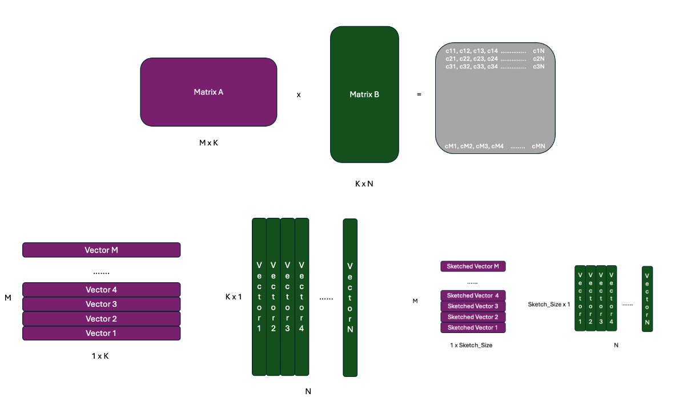
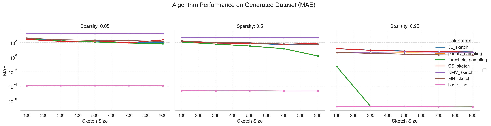

# BigData_CSGY6513_24Sp
## Introduction
This project centers on benchmarking vector inner product estimation methods, aiming to enhance computational efficiency in scientific and engineering applications. We provide a systematic evaluation of various sketching techniques under differing data conditions, focusing primarily on inner product estimation. The acceleration of matrix multiplication serves as an extension of our core study. This repository includes all the code, datasets, and documentation used in our analyses.

## Installation & Usage
### Install 
```shell
git clone https://github.com/Jas000n/BigData_CSGY6513_24Sp.git
cd BigData_CSGY6513_24Sp
pip install -r requirements.txt 
```
### Usage
To run benchmark:
```shell
python supermain.py
```
To plot results:
```shell
python plot.py
```
## Project Architecture
### General Pipeline

### Matrix Multiplication Acceleration


## Algos & Datasets
### Sketch Algorithms
| Sketch Algorithms                      |
|-----------------------|
| Johnson-Lindenstrauss Sketch | 
| Priority Sampling     | 
| Threshold Sampling    |
 | Count Sketch          |
| K-Minimum Values Sketch |
| MinHash Sketch        |
| Base Line             |
### Datasets
| Datasets |
|--| 
| NewsGroup20|
|Self Generated|
## Include Your Algos & Datasets
Please extend the dataset and algorithm classes by implementing the dataset_adaptor and ensure all its functions are implemented.
[dataset_adaptor.py](datasets%2Fdataset_adaptor.py)
[algorithm_adaptor.py](algorithms%2Falgorithm_adaptor.py)

## Results




## CMD Parameters
we have defined various configurable options for program's command line arguments, which can control the selection of algorithms, the use of datasets, and the characteristics of data, among other aspects. Here are detailed descriptions of these parameters:

- **--algo**: Specifies the algorithm to use. Options include:
  - 'JL_sketch'
  - 'priority_sampling'
  - 'threshold_sampling'
  - 'CS_sketch'
  - 'base_line'
  - 'KMV_sketch'
  - 'MH_sketch'
  This parameter is required and can be specified multiple times to append multiple algorithms.

- **--dataset**: Choose the type of dataset, either 'provided' (pre-provided dataset) or 'generated' (generated dataset).

- **--dataset_name**: If a 'provided' dataset is chosen, this parameter specifies the name of the dataset, with the default being '20newsgroups'.

- **--data_shape**: Specifies the shape of the data, formatted as the number of rows and columns for Matrix 1 and Matrix 2 respectively. The default is [1000, 500, 500, 1000].

- **--data_mean**: The mean value of the generated data, default is 10.

- **--data_deviation**: The standard deviation of the generated data, default is 1.

- **--sparsity**: The sparsity parameter, which defines the proportion of zeros in the matrix or vector. Default is 0.

- **--vector**: Specifies whether to use a vector instead of a matrix for calculations.

- **--type**: The type of data, either 'binary' or 'normal'.

- **--precision**: The precision type of data, options are 'float' (floating-point) or 'int' (integer).

- **--metrics**: Specifies the metrics to evaluate performance. Options include 'RMSE' (Root Mean Square Error) and 'MAE' (Mean Absolute Error). One or more metrics can be specified.

- **--num_runs**: Specifies the number of runs to average the performance metrics, default is 5 times.

- **--sketch_size**: Specifies the size of the sketch, which is required.

## Cite
If you find our project useful, please cite our project.
```bibtex
@misc{bigdata_final_project,
  title        = {Big Data Final Project},
  author       = {Shunyu Yao and Haoran Zhou and Stella Holbrook},
  year         = 2024,
  howpublished = {GitHub},
  url          = {https://github.com/Jas000n/BigData_CSGY6513_24Sp},
  institution  = {New York University}
}

```
